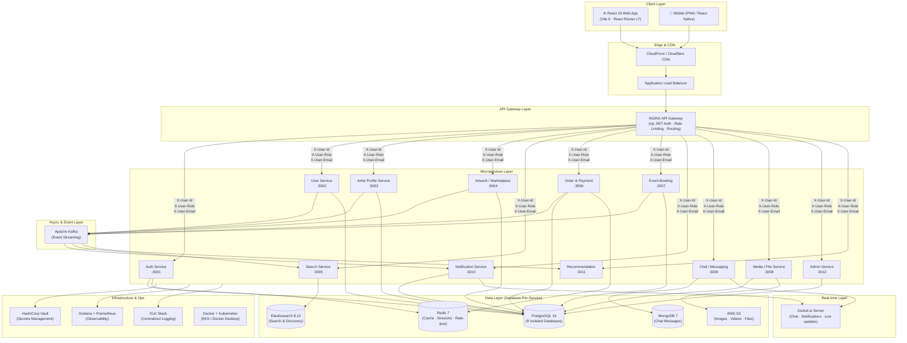
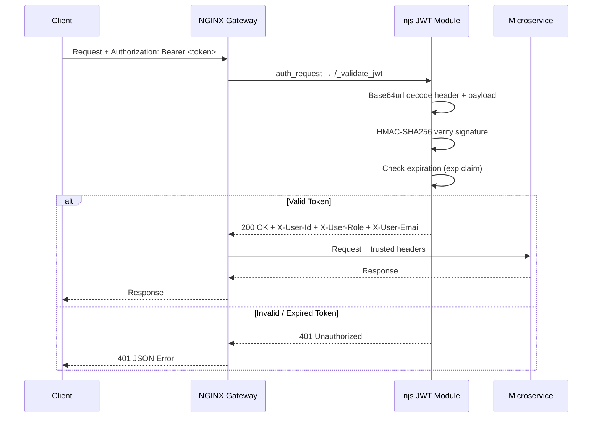
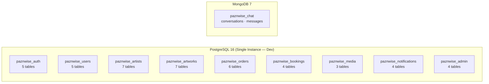
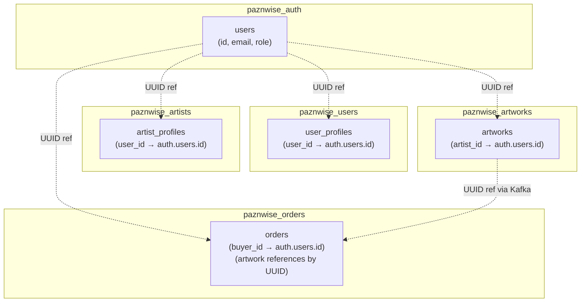
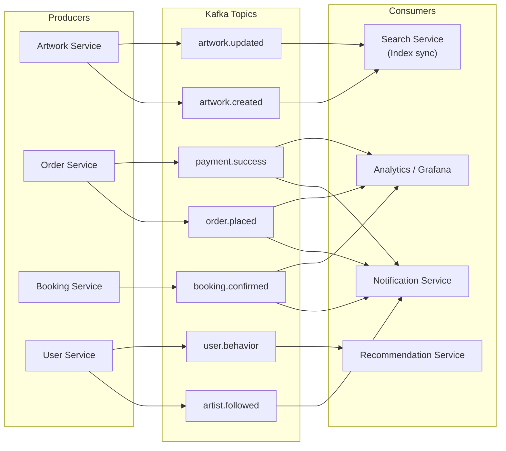
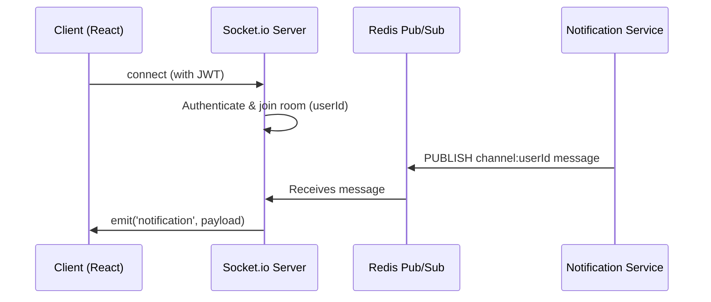
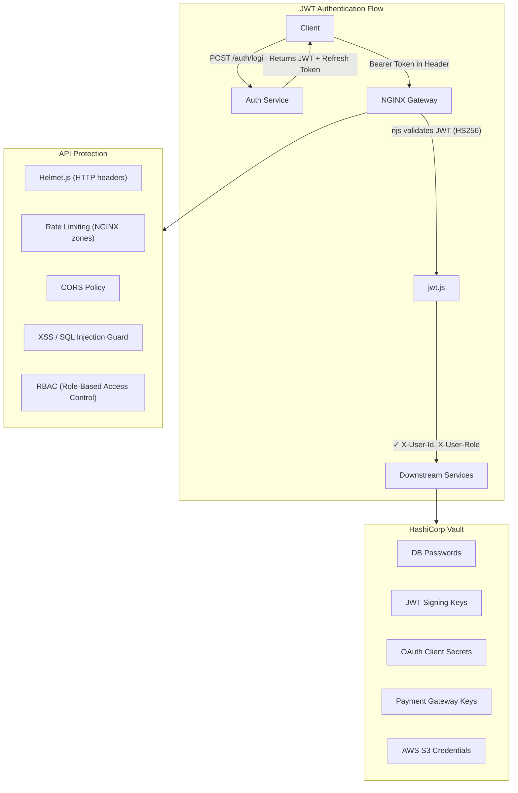
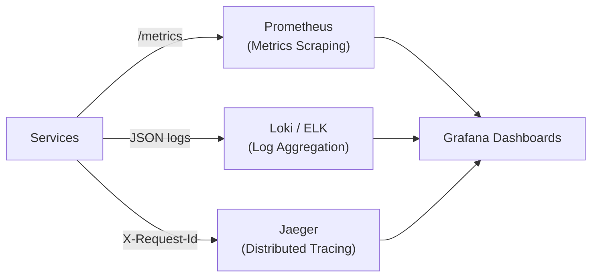
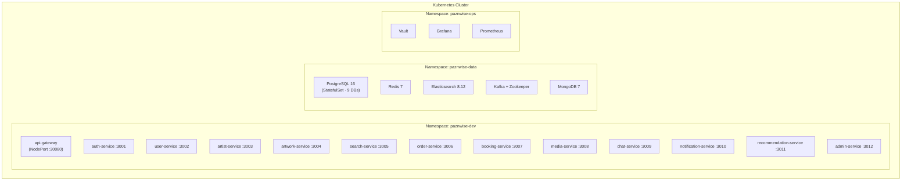

# 🎨 Paznwise — System Architecture
**Platform**: Online Art Marketplace & Event Booking  
**Company**: M/s Thraive Global Ventures LLP  
**Stack**: React 19 · Vite 6 · Node.js + Express · PostgreSQL · Elasticsearch · Redis · Kafka · Socket.io · Grafana · Vault

> [!IMPORTANT]
> **Confirmed Decisions** — Database: PostgreSQL (database-per-service) | Payment: Razorpay + Stripe (dual gateway) | Deployment: AWS EKS | Repo: Polyrepo (16 repositories)
> Frontend: React 19 + Vite 6 + React Router v7 | ESLint 9 (flat config) | Vitest 3
> Gateway: NGINX + njs (JWT validation at gateway level) | Local Dev: Docker Compose + Kubernetes (Skaffold)

---

## 1. High-Level Architecture Overview



---

## 2. Client Layer

### 2.1 React Web Application (`paznwise-web`)

| Concern | Technology | Version |
|---|---|---|
| Framework | **React** | **^19.1.0** ✅ |
| Build Tool | **Vite** | **^6.3.2** ✅ |
| Routing | **React Router** | **^7.5.1** ✅ (merged `react-router-dom`) |
| State Management | Redux Toolkit | ^2.5.1 |
| Server State / Cache | TanStack React Query | ^5.72.2 |
| HTTP Client | Axios | ^1.8.4 |
| Real-time | Socket.io-client | ^4.8.1 |
| Linting | **ESLint 9** (flat config) | **^9.24.0** ✅ |
| Testing | **Vitest 3** + Testing Library | **^3.1.1** ✅ |
| Auth | JWT + Refresh Tokens (httpOnly cookies) | — |
| Payments UI | Razorpay JS + Stripe.js (loaded on demand) | — |

> [!NOTE]
> **React 19 key changes adopted:**
> - `import React` not required — new JSX transform is default
> - `react-router-dom` replaced by `react-router` v7
> - `createRoot` used (mandatory in React 19, `render` removed)
> - ESLint rule `react/react-in-jsx-scope` explicitly disabled
> - `gcTime` replaces deprecated `cacheTime` in React Query v5
> - Vite config colocates Vitest config (no separate `vitest.config.js`)
> - Build outputs smart chunks: `vendor / router / state / query`

### 2.2 Mobile
- **Phase 1**: Progressive Web App (PWA) via React
- **Phase 2**: React Native (shared business logic with web)

---

## 3. API Gateway Layer — NGINX + njs JWT Authentication

The API Gateway is the single entry point for all client requests. It handles authentication **at the edge** — downstream services never validate JWTs themselves.



### 3.1 Gateway Configuration

| File | Purpose |
|---|---|
| `nginx.conf` | Main config — loads njs, defines upstreams, routes |
| `jwt.js` | njs JavaScript module — HS256 JWT validation + claim extraction |
| `proxy_params.conf` | Shared proxy headers (X-User-Id, X-User-Role, X-Request-Id) |

### 3.2 Route Classification

| Category | Routes | Auth |
|---|---|---|
| **Public** | `/api/v1/auth/*`, `/health`, `/api/v1/payments/webhook` | None |
| **Semi-Public** | `/api/v1/artworks`, `/api/v1/events`, `/api/v1/artists`, `/api/v1/search` | Optional (user extracted if token present) |
| **Protected** | `/api/v1/users/*`, `/api/v1/orders/*`, `/api/v1/payments/*`, `/api/v1/bookings/*`, `/api/v1/media/*`, `/api/v1/chat/*`, `/api/v1/notifications/*` | Required (JWT) |
| **Admin** | `/api/v1/admin/*` | Required + Role restriction (`SUPER_ADMIN`, `ADMIN`, `MODERATOR`, `FINANCE`) |

### 3.3 Gateway Responsibilities

- **JWT Validation** — HS256 signature verification via NGINX njs module
- **Claim Extraction** — `X-User-Id`, `X-User-Role`, `X-User-Email` headers injected into upstream requests
- **Rate Limiting** — Token bucket per IP via `limit_req_zone` (100r/m API, 10r/m auth)
- **SSL Termination** — TLS 1.2/1.3, HTTPS enforcement
- **Request Tracing** — `X-Request-Id` header for distributed tracing
- **Security Headers** — `X-Frame-Options`, `Strict-Transport-Security`, `X-Content-Type-Options`
- **WebSocket Support** — Upgrade headers for Socket.io / Chat

> [!IMPORTANT]
> **Design Decision**: Services trust `X-User-Id` and `X-User-Role` headers **only** from the gateway. In production, the network policy ensures services reject direct external traffic.

---

## 4. Microservices Breakdown

### 4.1 Auth Service (port 3001 · DB: `paznwise_auth`)
```
POST /auth/register
POST /auth/login
POST /auth/refresh
POST /auth/logout
POST /auth/social (Google, Facebook, OTP)
POST /auth/verify-otp
```
- **Technologies**: Express, Passport.js, bcrypt, JWT, Twilio (OTP), OAuth2
- **Stores**: PostgreSQL (`paznwise_auth`), Redis (refresh token blacklist, session cache)
- **Vault**: Fetches JWT secret, OAuth client secrets at runtime
- **Tables**: `users`, `refresh_tokens`, `oauth_providers`, `login_attempts`, `otp_codes`

---

### 4.2 User Service (port 3002 · DB: `paznwise_users`)
```
GET  /users/:id
PUT  /users/:id
GET  /users/:id/followers
POST /users/:id/follow
GET  /users/:id/wishlist
```
- Manages buyer/artist/organizer/gallery profiles
- User roles: `ARTIST`, `BUYER`, `ORGANIZER`, `GALLERY`, `ADMIN`
- **Tables**: `user_profiles`, `user_addresses`, `user_follows`, `user_preferences`, `user_wishlists`

---

### 4.3 Artist Profile Service (port 3003 · DB: `paznwise_artists`)
```
GET    /artists/:id
PUT    /artists/:id/profile
POST   /artists/:id/portfolio
GET    /artists/:id/reviews
POST   /artists/:id/reviews
```
**Profile Schema Entities:**
- Bio, Skills, Awards, Education, Exhibitions
- Portfolio (linked to Media Service)
- Followers count (denormalized in Redis)
- Verification badge (admin-controlled)
- Auto-calculated average rating (PostgreSQL trigger)
- **Tables**: `artist_profiles`, `artist_skills`, `artist_awards`, `artist_education`, `artist_exhibitions`, `portfolio_items`, `artist_reviews`

---

### 4.4 Artwork / Marketplace Service (port 3004 · DB: `paznwise_artworks`)
```
POST   /artworks          (create listing)
GET    /artworks          (browse with filters)
GET    /artworks/:id
PUT    /artworks/:id
DELETE /artworks/:id
GET    /artworks/trending
GET    /artworks/curated
```
**Artwork Entity Fields:**
- title, category, price, medium, size, style
- artist_id, description, story_behind
- shipping_options, availability_status
- images (S3 URLs via Media Service)
- SEO slug, tags (GIN index for full-text)

**On Create/Update → Publishes to Kafka** → consumed by Search Service to index in Elasticsearch.
- **Tables**: `artwork_categories` (hierarchical, 14 seed categories), `artworks`, `artwork_images`, `artwork_likes`, `artwork_views`, `artwork_comments`
- **Triggers**: Auto-increment like/view/comment counters on artworks table

---

### 4.5 Search Service (port 3005 · Elasticsearch)
```
GET /search?q=&category=&price_min=&price_max=&location=&medium=&style=&size=
GET /search/artists?q=
GET /search/events?q=
```
- Powered by **Elasticsearch 8.12**
- Indices: `artworks`, `artists`, `events`
- Supports: fuzzy search, filters, faceted search, geo-distance (location-based)
- Consumes Kafka events to keep index in sync

---

### 4.6 Order & Payment Service (port 3006 · DB: `paznwise_orders`)
```
POST   /orders                  (create order)
GET    /orders/:id
GET    /orders/user/:userId
PUT    /orders/:id/status
POST   /payments/initiate
POST   /payments/webhook        (gateway callback — public)
POST   /payments/refund
```
- Integrates with **Razorpay / Stripe** (dual gateway)
- Handles: commission deduction logic, artist payout scheduling
- **Commission engine**: configurable % stored in DB, managed via Admin Service (default 15%)
- Redis used for idempotency keys (prevent duplicate payments)
- Auto-generated order numbers: `PZN-YYYYMMDD-XXXX`
- Publishes `ORDER_PLACED`, `PAYMENT_SUCCESS` events to Kafka
- **Tables**: `orders`, `order_items`, `payments`, `refunds`, `commission_config`, `artist_payouts`

---

### 4.7 Event Booking Service (port 3007 · DB: `paznwise_bookings`)
```
POST   /events               (artist lists a service)
GET    /events
GET    /events/:id
POST   /events/:id/book      (organizer books artist)
GET    /bookings/:id
PUT    /bookings/:id/status
```
**Booking Flow:**
```
Browse Events → Select Date/Slot → Book Artist → Pay → Confirmation
```
- Manages artist availability calendar with date/time slots
- Auto-generated booking numbers: `PZB-YYYYMMDD-XXXX`
- 8 service types: `wedding`, `corporate`, `private_party`, `exhibition`, `workshop`, `live_painting`, `mural`, `custom`
- Sends booking confirmation via Notification Service
- **Tables**: `events`, `event_slots`, `bookings`, `booking_payments`

---

### 4.8 Media / File Service (port 3008 · DB: `paznwise_media`)
```
POST /media/upload     (returns S3 pre-signed URL)
DELETE /media/:id
```
- **Flow**: Client uploads directly to S3 via pre-signed URL (no bandwidth through server)
- Stores metadata (filename, size, type, uploader, linked_entity) in PostgreSQL
- SHA-256 checksum verification, EXIF metadata extraction
- 5 thumbnail variants: `sm`, `md`, `lg`, `preview`, `watermarked`
- Integrates with CDN (CloudFront) for fast global delivery
- Image processing: thumbnail generation via AWS Lambda on upload
- **Tables**: `media_files`, `media_thumbnails`, `upload_sessions`

---

### 4.9 Chat / Messaging Service (port 3009 · MongoDB: `paznwise_chat`)
```
WebSocket: socket.io (real-time)
POST /conversations
GET  /conversations/:userId
GET  /messages/:conversationId
```
- Messages stored in **MongoDB** (flexible, high write throughput)
- Real-time delivery via **Socket.io**
- Supports: chat with artist, custom artwork requests, price negotiation

---

### 4.10 Notification Service (port 3010 · DB: `paznwise_notifications`)
- **Consumes Kafka topics**: `order.placed`, `booking.confirmed`, `artwork.sold`, `message.received`, `artist.followed`
- Channels: Push (FCM/APNs), Email (SendGrid / AWS SES), SMS, In-app (Socket.io)
- Per-user, per-notification-type channel preferences
- 10 pre-configured notification templates (order, payment, booking, social, system)
- Push subscription management (multi-device, multi-platform)
- Delivery tracking with status (pending → sent → delivered → failed)
- **Tables**: `notification_templates`, `notifications`, `notification_preferences`, `push_subscriptions`

---

### 4.11 Recommendation Service (port 3011 · Redis + Kafka)
- Consumes user behavior events from Kafka (`artwork.viewed`, `artwork.liked`, `search.query`)
- Builds collaborative + content-based recommendation models
- Results cached in **Redis** (TTL: 1 hour per user)
- **Phase 3** feature — AI/ML layer (Python microservice, called via REST from Node)

---

### 4.12 Admin Service (port 3012 · DB: `paznwise_admin`)
```
GET    /admin/users
PUT    /admin/users/:id/verify
GET    /admin/artworks (pending moderation)
PUT    /admin/artworks/:id/approve
GET    /admin/analytics
PUT    /admin/commission-config
GET    /admin/audit-logs
GET    /admin/moderation-queue
PUT    /admin/settings
```
- Role-based access: `SUPER_ADMIN`, `MODERATOR`, `FINANCE`
- **Immutable audit logs** — every admin action recorded with before/after state snapshots
- **Moderation queue** — artwork review, artist verification, user reports, refund review
- **Platform settings** — feature flags, commission rates, limits (key-value store with 16 seed configs)
- **Daily analytics snapshots** — users, revenue, GMV, DAU aggregated per day
- Powers the Admin Dashboard (separate React SPA)
- **Tables**: `admin_audit_logs`, `moderation_queue`, `platform_settings`, `analytics_daily`

---

## 5. Database Architecture — Database-Per-Service Pattern

### 5.1 Isolation Strategy

Each microservice owns its **own PostgreSQL database**. There are **no cross-database foreign keys or JOINs**. Cross-service data references use UUIDs at the application level.



> [!NOTE]
> **Local Development**: All 9 PostgreSQL databases run in a single PostgreSQL instance (created via `init-databases.sql`).
> **Production**: Each service connects to its own RDS instance (or shared RDS with separate schemas) via Vault dynamic credentials.

### 5.2 Database Allocation

| Service | Database | Tables | Key Features |
|---|---|---|---|
| Auth | `paznwise_auth` | 5 | Users, refresh tokens, OAuth, login attempts, OTP |
| User | `paznwise_users` | 5 | Profiles, addresses, follows, preferences, wishlists |
| Artist | `paznwise_artists` | 7 | Profiles, skills, awards, education, exhibitions, portfolio, reviews |
| Artwork | `paznwise_artworks` | 7 | Categories (hierarchical), artworks, images, likes, views, comments |
| Order | `paznwise_orders` | 6 | Orders, items, payments, refunds, commission config, payouts |
| Booking | `paznwise_bookings` | 4 | Events, slots, bookings, booking payments |
| Media | `paznwise_media` | 3 | Files, thumbnails, upload sessions |
| Notification | `paznwise_notifications` | 4 | Templates, notifications, preferences, push subscriptions |
| Admin | `paznwise_admin` | 4 | Audit logs, moderation queue, settings, analytics |
| **Total** | **9 databases** | **45 tables** | |

### 5.3 Schema Design Patterns

All database schemas follow consistent conventions:

- **UUIDs** as primary keys (`uuid_generate_v4()`)
- **`created_at` / `updated_at`** timestamps with auto-update triggers
- **Cross-service references by UUID** — no cross-database foreign keys
- **JSONB columns** for flexible structured data (social links, gateway responses, metadata)
- **CHECK constraints** for enum-like fields (status, roles, types)
- **Partial indexes** for common query patterns (active records, unread notifications)
- **GIN indexes** for array/full-text search (tags)
- **Seed data** where appropriate (categories, templates, settings)
- **Auto-generated identifiers** (order numbers `PZN-*`, booking numbers `PZB-*`)
- **Denormalized counters** with triggers (like counts, review averages, follower counts)

### 5.4 Cross-Service Data Flow



> Cross-service references are resolved via **API calls** or **Kafka events** — never direct database queries.

### 5.5 Redis Usage

| Key Pattern | Purpose | TTL |
|---|---|---|
| `session:{userId}` | Session data | 24h |
| `refresh_token:{jti}` | Blacklist | Token expiry |
| `rate_limit:{ip}:{route}` | Rate limiter counter | 1 min |
| `recommendations:{userId}` | AI recs cache | 1h |
| `followers:{artistId}` | Follower count | 10 min |
| `idempotency:{key}` | Payment idempotency | 24h |
| `trending:artworks` | Trending list | 30 min |

### 5.6 Elasticsearch Indices

```json
// artworks index mapping (simplified)
{
  "title": "text",
  "description": "text",
  "category": "keyword",
  "style": "keyword",
  "medium": "keyword",
  "price": "float",
  "location": "geo_point",
  "artist_name": "text",
  "size": "keyword",
  "status": "keyword",
  "tags": "keyword",
  "created_at": "date"
}
```

---

## 6. Kafka Event Architecture



**Kafka Configuration:**
- Topics: partitioned for parallel consumption
- Consumer groups per service (e.g., `paznwise-auth-service-group`)
- Retention: 7 days
- Schema Registry (Avro) for message contracts

---

## 7. Real-time Layer — Socket.io



**Socket Events:**
| Event | Direction | Purpose |
|---|---|---|
| `message:new` | Server → Client | New chat message |
| `notification:in-app` | Server → Client | Order update, booking confirm |
| `artwork:liked` | Client → Server | Like broadcast to artist |
| `user:online` | Client → Server | Presence tracking |

**Scaling**: Socket.io with Redis Adapter for multi-node deployments.

---

## 8. Security Architecture



**Key Practices:**
- **Gateway-level JWT validation** — services never verify tokens; they trust `X-User-Id` and `X-User-Role` headers from the gateway
- All secrets fetched from **Vault** at startup — never hardcoded or in `.env` in production
- `httpOnly` + `Secure` cookies for refresh tokens
- Rate limiting: 100r/m for API, 10r/m for auth endpoints
- Artwork IP verified on upload (watermarking strategy — Phase 2)
- PCI-DSS compliant payment handling (tokens only, no raw card data)
- Artist verification workflow (KYC-lite) via admin
- Admin routes restricted to specific roles at the gateway level

---

## 9. Observability Stack



**Grafana Dashboards:**
| Dashboard | Metrics |
|---|---|
| Platform Overview | DAU, MAU, Revenue, GMV |
| Service Health | Latency (p50/p95/p99), Error rates |
| Kafka Lag | Consumer group lag per topic |
| Database | Query times, connection pool per service |
| Cache | Redis hit/miss ratio |
| Payments | Success rate, failure breakdown |
| API Gateway | Request rate, JWT validation failures, rate limit hits |

**Alerting**: PagerDuty / Slack integration for P0/P1 alerts.

---

## 10. Infrastructure & Deployment

### 10.1 Container Architecture (Kubernetes)



### 10.2 Local Development Options

| Mode | Command | RAM | Use Case |
|---|---|---|---|
| **Docker Compose** (full) | `docker compose up -d` | ~8-10 GB | Simple, one-command startup |
| **Docker Compose** (data only) | `docker compose up -d postgres redis kafka` | ~2 GB | Run services directly with `node` |
| **Kubernetes** (full) | `./scripts/start-local.sh` | ~10 GB | Production parity |
| **Kubernetes** (minimal) | `./scripts/start-local.sh --minimal` | ~4 GB | Core services only |
| **Skaffold** (dev loop) | `skaffold dev` | ~10 GB | Auto-rebuild on code change |
| **Skaffold** (minimal) | `skaffold dev -p minimal` | ~4 GB | Fast iteration, core services |

### 10.3 CI/CD Pipeline

```
Developer → GitHub PR → GitHub Actions
  → Lint + Unit Tests
  → Build Docker Image
  → Push to ECR (AWS Elastic Container Registry)
  → Deploy to Staging (Helm)
  → Integration Tests
  → Manual Approval (Production)
  → Deploy to Production (Rolling update via Helm)
```

### 10.4 Environment Strategy

| Environment | Infrastructure | Purpose |
|---|---|---|
| `local` | Docker Desktop (Compose / K8s) | Developer machines |
| `dev` | EKS dev cluster | Feature branch deployments |
| `staging` | EKS staging cluster | QA / pre-release (mirrors prod) |
| `production` | EKS production cluster | Live platform |

### 10.5 Infrastructure as Code

| Tool | Scope | Files |
|---|---|---|
| **Docker Compose** | Local dev | `docker-compose/docker-compose.yml` |
| **Kubernetes** | Local + cloud | `k8s/` (20 manifests) |
| **Helm** | Production deploy | `helm/paznwise-services/` (7 templates) |
| **Terraform** | AWS infrastructure | `terraform/modules/` (EKS, RDS, S3, ElastiCache, VPC, Kafka) |
| **Skaffold** | Dev loop | `skaffold.yaml` (full + minimal profiles) |

### 10.6 Production AWS Architecture

| Component | AWS Service | Config |
|---|---|---|
| Compute | EKS 1.29 | Managed node groups, spot instances |
| Database | RDS PostgreSQL 16 | Multi-AZ, encrypted, per-service instances |
| Cache | ElastiCache Redis 7 | Cluster mode, encryption |
| Search | OpenSearch 2.x | 3-node cluster |
| Events | MSK (Managed Kafka) | 3-broker, 3-AZ |
| Files | S3 + CloudFront | Pre-signed uploads, CDN delivery |
| Secrets | Vault on EKS | Dynamic DB credentials |
| DNS | Route 53 | api.paznwise.com |
| SSL | ACM | Auto-renewed certificates |
| Monitoring | CloudWatch + Grafana | Metrics, logs, alerts |

---

## 11. Phased Rollout (Aligned with BRD)

### Phase 1 — MVP
- [ ] Auth (Email + Google + OTP)
- [ ] Artist onboarding & profile
- [ ] Artwork listing & marketplace
- [ ] Search (Elasticsearch)
- [ ] Order & Payment (Razorpay)
- [ ] Media upload (S3)
- [ ] Basic Admin panel
- [ ] Notifications (Email + In-app)

### Phase 2 — Event Booking
- [ ] Artist service listings
- [ ] Event booking & calendar
- [ ] Artist payout system (automated)
- [ ] Advanced Admin analytics (Grafana)
- [ ] PWA mobile support
- [ ] Chat / Messaging (Socket.io + MongoDB)

### Phase 3 — Community & AI
- [ ] Social features (follow, like, share, comments)
- [ ] AI Recommendations (Kafka + ML service)
- [ ] AR Wall Preview (WebXR)
- [ ] NFT Marketplace (Blockchain layer)
- [ ] Virtual exhibitions
- [ ] Artist crowdfunding

---

## 12. Key Non-Functional Targets

| Attribute | Target |
|---|---|
| Page Load Time | < 3 seconds (p95) |
| API Latency | < 200ms (p95) for read, < 500ms for write |
| Uptime SLA | 99.9% |
| Search Latency | < 100ms |
| Concurrent Users | 10,000+ (Phase 1), 1M+ (Phase 3) |
| Image Upload | Via S3 pre-signed URL (offloaded from API servers) |
| Data Encryption | AES-256 at rest, TLS 1.3 in transit |

---

## 13. Technology Decision Summary

| Layer | Technology | Version | Rationale |
|---|---|---|---|
| **Frontend** | **React** ✅ | **19.1** | New JSX transform, concurrent features, compiler-ready |
| **Build Tool** | **Vite** ✅ | **6.3** | Sub-second HMR, ESM-native, smart chunk splitting |
| **Routing** | **React Router** ✅ | **7.5** | Merged package (no more react-router-dom), v7 loader API |
| Server State | TanStack React Query | 5.72 | Caching, background sync, devtools |
| Client State | Redux Toolkit | 2.5 | Predictable global state, RTK Query as fallback |
| Linting | **ESLint 9** ✅ | **9.24** | Flat config, faster, future-proof |
| Testing | **Vitest 3** ✅ | **3.1** | Vite-native, faster than Jest, same API |
| **API Gateway** | **NGINX + njs** ✅ | **1.25** | JWT validation at edge, rate limiting, zero-latency auth |
| Backend Services | Node.js + Express | 20 LTS | JS everywhere, non-blocking I/O |
| **Primary DB** | **PostgreSQL** ✅ | **16** | ACID compliance, JSONB, database-per-service isolation |
| Cache | Redis | 7 | Pub/Sub, Socket.io adapter, rate-limit, idempotency |
| Search | Elasticsearch | 8.12 | Full-text, faceted, geo-distance |
| Messaging DB | MongoDB | 7 | Flexible schema for chat threads |
| Event Streaming | Apache Kafka | 3.7 | Durable, high-throughput, Schema Registry |
| File Storage | **AWS S3 + CloudFront** ✅ | — | Pre-signed uploads, CDN delivery |
| Real-time | Socket.io | 4.8 | Rooms, namespaces, Redis adapter |
| Payment | **Razorpay + Stripe** ✅ | — | Razorpay (India/UPI), Stripe (international) |
| Secrets | HashiCorp Vault | 1.16 | Dynamic secrets, audit logging |
| Observability | Grafana + Prometheus + Jaeger | — | Metrics, logs (Loki), distributed traces |
| **Orchestration** | **Docker Desktop K8s / AWS EKS** ✅ | **1.29** | Local parity with production |
| IaC | Terraform | ~5.0 | AWS VPC, EKS, RDS, ElastiCache |
| **Deployment** | **Helm + Skaffold + GitHub Actions** ✅ | — | Declarative K8s releases, CI/CD, dev loop |
| **Dev Tools** | **kubectl · Helm · Skaffold** ✅ | — | K8s CLI, package manager, auto-rebuild |
| Repo Strategy | **Polyrepo** ✅ | 16 repos | Independent ownership, isolated CI per service |

---

## 14. Frontend File Structure (`paznwise-web`)

```
paznwise-web/
├── public/                      # Static assets (favicon, robots.txt)
├── src/
│   ├── main.jsx                 # App entry — createRoot, Providers
│   ├── App.jsx                  # Route definitions (react-router v7)
│   ├── index.css                # Global design tokens & base styles
│   ├── components/
│   │   ├── common/              # Button, Input, Modal, Badge, Spinner
│   │   ├── layout/              # Layout, Navbar, Sidebar, Footer
│   │   ├── artworks/            # ArtworkCard, ArtworkGrid, ArtworkDetail
│   │   ├── artists/             # ArtistCard, ArtistProfile, FollowButton
│   │   ├── events/              # EventCard, BookingForm, Calendar
│   │   ├── orders/              # Cart, Checkout, OrderStatus
│   │   └── auth/                # LoginForm, RegisterForm, OTPInput
│   ├── pages/                   # Route-level page components
│   ├── store/                   # Redux slices (auth, cart, ui)
│   ├── hooks/                   # useAuth, useSocket, useSearch, useCart
│   ├── services/
│   │   ├── api.js               # Axios instance + interceptors (JWT refresh)
│   │   ├── socket.js            # Socket.io-client singleton
│   │   └── payment.js           # Razorpay + Stripe loader utils
│   ├── utils/                   # formatPrice, formatDate, validators
│   ├── test/
│   │   └── setup.js             # @testing-library/jest-dom setup
│   └── assets/                  # Images, icons, fonts
├── vite.config.js               # Vite 6 + Vitest config (co-located)
├── eslint.config.js             # ESLint 9 flat config
├── index.html                   # Entry HTML (SEO meta, title)
├── package.json                 # React 19 + all deps
└── .env.example                 # VITE_API_BASE_URL, VITE_SOCKET_URL etc.
```

---

## 15. Repository Map

```
pazn/                                    ← Workspace root
├── paznwise-infrastructure/             # IaC: Docker, K8s, Helm, Terraform
│   ├── docker-compose/                  #   Docker Compose + DB init scripts
│   ├── k8s/                             #   20 K8s manifests (2 namespaces)
│   ├── helm/                            #   Helm chart (7 templates)
│   ├── terraform/                       #   AWS IaC (6 modules, 2 envs)
│   └── scripts/                         #   setup, start, stop, logs, status
├── paznwise-api-gateway/                # NGINX + njs JWT auth
├── paznwise-auth-service/               # Auth (port 3001, DB: paznwise_auth)
├── paznwise-user-service/               # Users (port 3002, DB: paznwise_users)
├── paznwise-artist-service/             # Artists (port 3003, DB: paznwise_artists)
├── paznwise-artwork-service/            # Artworks (port 3004, DB: paznwise_artworks)
├── paznwise-search-service/             # Search (port 3005, Elasticsearch)
├── paznwise-order-service/              # Orders (port 3006, DB: paznwise_orders)
├── paznwise-booking-service/            # Bookings (port 3007, DB: paznwise_bookings)
├── paznwise-media-service/              # Media (port 3008, DB: paznwise_media)
├── paznwise-chat-service/               # Chat (port 3009, MongoDB)
├── paznwise-notification-service/       # Notifications (port 3010, DB: paznwise_notifications)
├── paznwise-recommendation-service/     # Recommendations (port 3011, Redis)
├── paznwise-admin-service/              # Admin (port 3012, DB: paznwise_admin)
├── paznwise-shared-libs/                # Shared utilities, middleware
├── paznwise-web/                        # React 19 frontend (Vite 6)
└── skaffold.yaml                        # Skaffold dev loop config
```

---

*Document Version: 2.0 | Updated: April 2026 | Platform: Paznwise by Thraive Global Ventures LLP*
